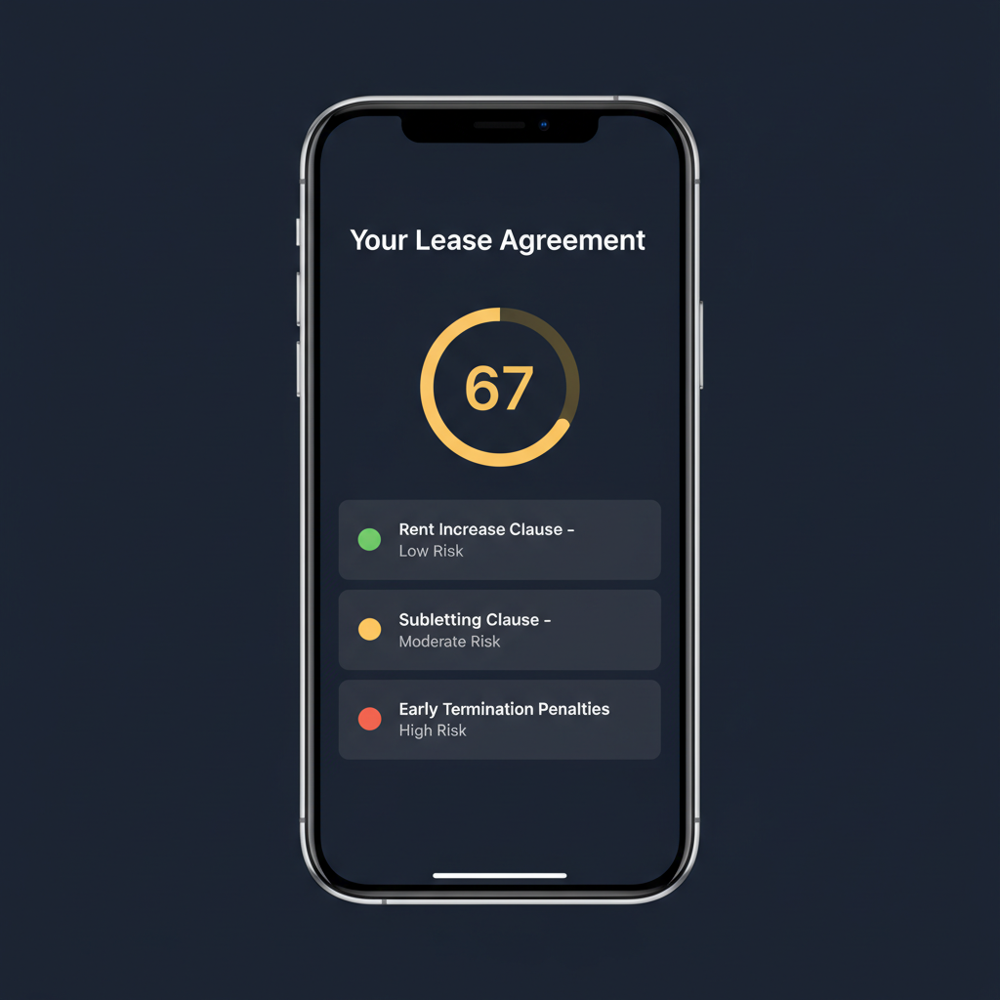
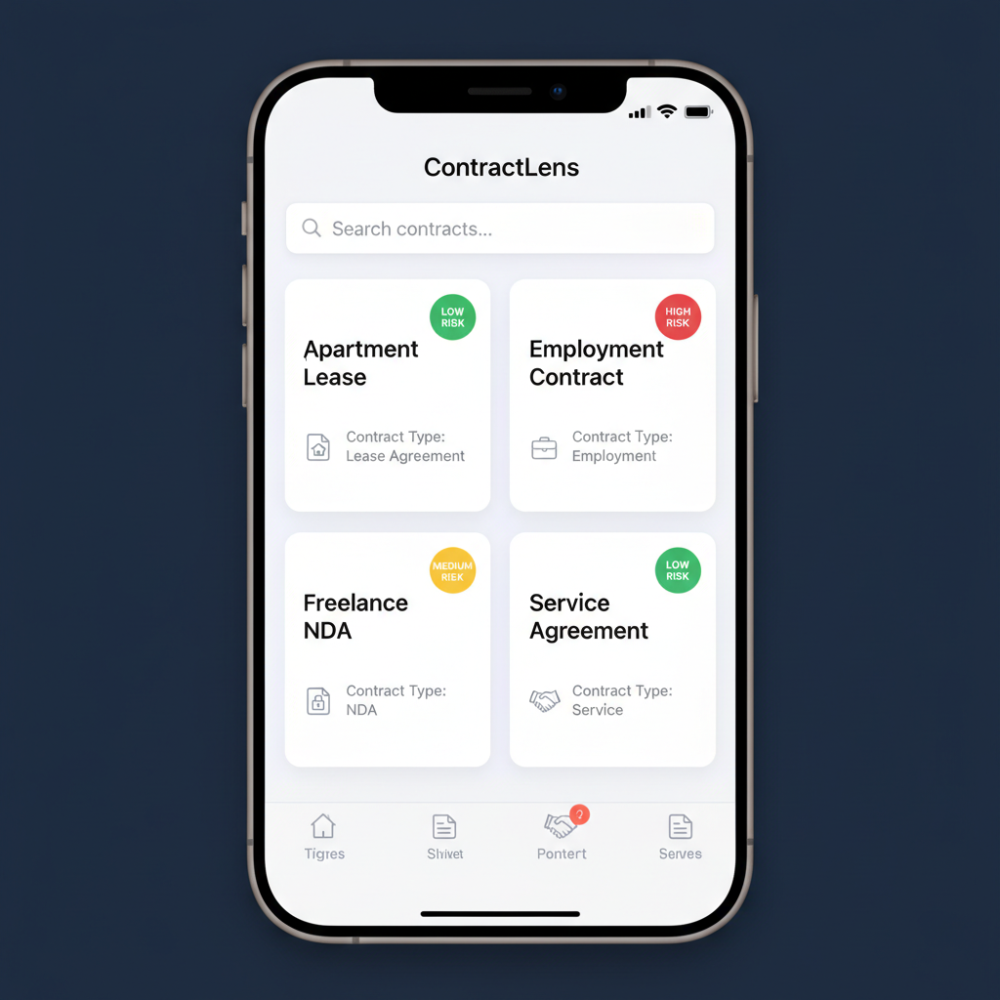
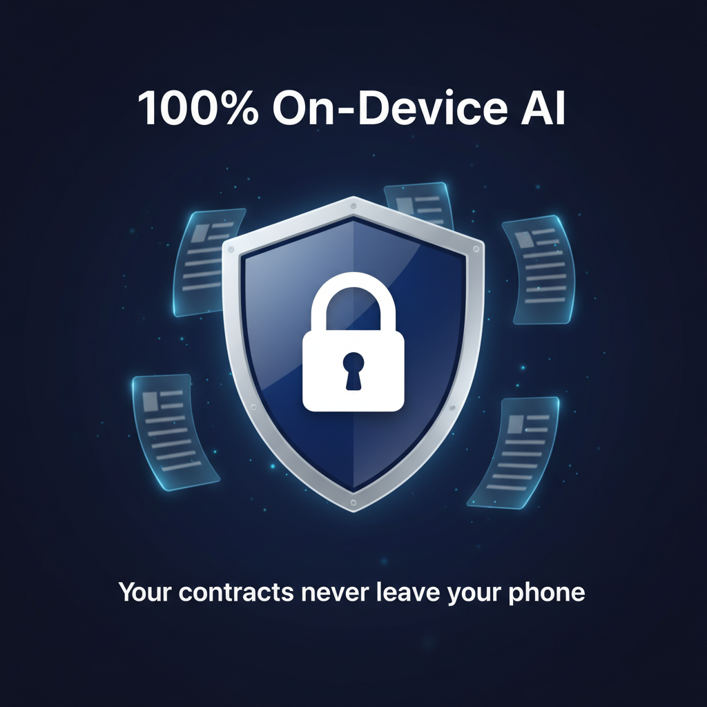

# ContractLens - AI Contract Analyzer

**Understand Before You Sign**

ContractLens uses Apple's on-device Foundation Models to analyze legal documents — contracts, leases, NDAs, and more. 100% private, 100% offline, zero data collection.

## Key Features

- **AI-Powered Analysis** — Breaks down complex legal language into plain English
- **Risk Assessment** — Color-coded risk levels (Low/Medium/High) with scores 0-100
- **Clause Extraction** — Identifies and explains important clauses with risk ratings
- **Party Identification** — Maps out who's who and their obligations
- **Key Date Detection** — Highlights deadlines and important dates
- **100% On-Device** — Your documents never leave your phone. No servers, no APIs, no tracking
- **iPad Support** — Full NavigationSplitView layout with sidebar on iPad

## Screenshots

| Analysis | Document Library | Privacy |
|----------|-----------------|---------|
|  |  |  |

## Requirements

- iPhone 15 Pro or newer (Apple Foundation Models requires A17 Pro+ chip)
- iPad with M1 chip or newer
- iOS 18.0+
- Xcode 16+

## Setup

```bash
# 1. Clone the repo
git clone https://github.com/alexandra767/ContractLens.git
cd ContractLens

# 2. Generate Xcode project (requires XcodeGen)
brew install xcodegen
xcodegen generate

# 3. Open in Xcode
open ContractLens.xcodeproj

# 4. Set your Development Team in Signing & Capabilities
# 5. Build & run on a physical device (Foundation Models requires real hardware)
```

Or just run `./setup.sh` which does steps 2-3 automatically.

## Architecture

```
MVVM + Services
├── Views (SwiftUI)
│   → ViewModels (@Observable)
│     → Services Layer
│       → Data Layer (SwiftData + Foundation Models @Generable)
│         → Apple Frameworks (no network layer needed)
```

**50 Swift files** across:
- 3 SwiftData models
- 5 Foundation Models @Generable AI structs
- 8 service classes
- 5 ViewModels
- 24 SwiftUI views
- 3 extensions
- 1 app entry point + constants

## Tech Stack

| Component | Framework | Cost |
|-----------|-----------|------|
| AI Analysis | Foundation Models | Free (on-device) |
| Document Scanning | VisionKit | Free |
| OCR | Vision | Free |
| PDF Parsing | PDFKit | Free |
| Local Storage | SwiftData | Free |
| Cloud Sync | iCloud (automatic) | Free |
| Payments | StoreKit 2 | Free |

**Total ongoing cost: $0** (beyond the $99/yr Apple Developer account)

## Monetization

| Feature | Free | Pro ($9.99/mo or $49.99/yr) |
|---------|------|-----|
| Analyses/month | 3 | Unlimited |
| Clause breakdown | First 3 | All clauses |
| Export as PDF | No | Yes |
| Re-analyze | No | Yes |
| History | 30 days | Unlimited |

## Privacy

ContractLens collects **zero data**. The App Store privacy label is "Data Not Collected" for all categories. See the full [Privacy Policy](ContractLens/Resources/PrivacyPolicy.md).

## Disclaimer

ContractLens provides AI-generated analysis for informational purposes only. It is not a substitute for legal advice from a licensed attorney.

## License

Copyright 2026. All rights reserved.
